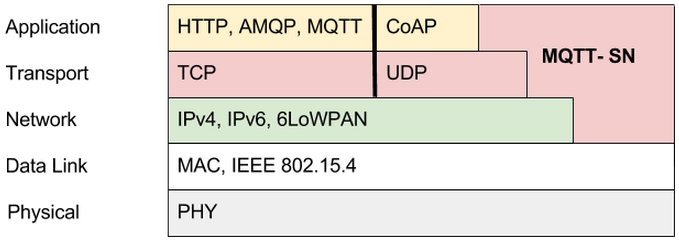
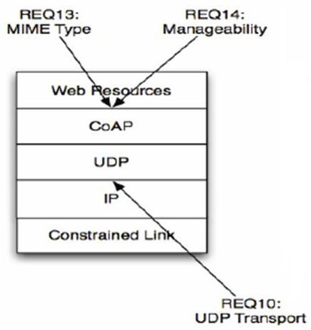
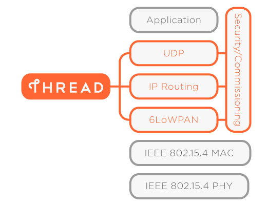

##Internet of Things Protocol

Protocol |	CoAP  |	XMPP |	RESTful HTTP |	MQTT
---------|---------|---------|---------|---------
Transport |	UDP |	TCP |	TCP |	TCP
Messaging |	Request/Response |	Publish/Subscribe Request/Response |	Request/Response |	Publish/Subscribe Request/Response
2G, 3G, 4G Suitability (1000s nodes) | Excellent |	Excellent |	Excellent |	Excellent
LLN Suitability (1000s nodes) | Excellent |	Fair |	Fair |	Fair
Compute Resources | 10Ks RAM/Flash | 10Ks RAM/Flash | 10Ks RAM/Flash | 10Ks RAM/Flash
Success Storied	| Utility Field Area Networks |		Remote management of consumer white goods |	Smart Energy Profile 2 (premise energy management/home services) |	Extending enterprise messaging into IoT applications

###XMPP

The Extensible Messaging and Presence Protocol (XMPP) is an open technology for real-time communication, which powers a wide range of applications including instant messaging, presence, multi-party chat, voice and video calls, collaboration, lightweight middleware, content syndication, and generalized routing of XML data. The technology pages provide more information about the various XMPP “building blocks”. Several books about Jabber/XMPP technologies are available, as well.

###MQTT

MQTT is a machine-to-machine (M2M)/"Internet of Things" connectivity protocol. It was designed as an extremely lightweight publish/subscribe messaging transport. It is useful for connections with remote locations where a small code footprint is required and/or network bandwidth is at a premium.

[MQTT Library](./protocol/MQTT.lib.md)

###CoAP

Constrained Application Protocol (CoAP) is a software protocol intended to be used in very simple electronics devices that allows them to communicate interactively over the Internet. It is particularly targeted for small low power sensors, switches, valves and similar components that need to be controlled or supervised remotely, through standard Internet networks. CoAP is an application layer protocol that is intended for use in resource-constrained internet devices, such as WSN nodes. 

###RESTful HTTP

Representational State Transfer (REST) is a software architecture style for building scalable web services.REST gives a coordinated set of constraints to the design of components in a distributed hypermedia system that can lead to a higher performing and more maintainable architecture.

###Thread

THREAD SOLVES RELIABILITY, SECURITY, POWER, AND COMPATIBILITY ISSUES FOR CONNECTING PRODUCTS AROUND THE HOME. ONCE AND FOR ALL.

##IoT Platform

###Yeelink

Homepage: [http://www.yeelink.net/](http://www.yeelink.net/)

###SiteWhere

> The Open Platform for the Internet of Things ™

- Speed time to market for your IoT application
- Leverage framework and APIs for custom development
- Focus on solving business problems, not reinventing the wheel
- Download source code for Community Edition from GitHub
- Provided under CPAL 1.0 license

Homepage: [http://www.sitewhere.org/](http://www.sitewhere.org/)

##IoT Embedded OS

###Contiki

> Contiki is an open source operating system that runs on tiny low-power microcontrollers and makes it possible to develop applications that make efficient use of the hardware while providing standardized low-power wireless communication for a range of hardware platforms.

Project Page: [https://github.com/contiki-os/contiki](https://github.com/contiki-os/contiki)

###mbed OS

> mbed™ OS is an operating system for IoT devices and is especially well-suited to run in energy constrained environments. The OS includes the connectivity, security and device management functionalities required in every IoT device.

 - Connectivity protocol stack support for Bluetooth® low energy, Cellular, Ethernet, Thread, Wi-fi®,  Zigbee IP, Zigbee NAN, 6LoWPAN
 - Automation of power management
 - Software asset protection and secure firmware updates for device security & management
 - Supports a wide range of ARM Cortex-M based hardware platforms from major MCU vendors
 - Support for OMA Lightweight M2M protocol for device management
 - Updatable and secure devices at the edge capable of additional processing and functionality
 - Banking-class end-to-end IP security across the communication channels through TLS & DTLS 
 - Future proof designs by supporting all the key open standards for connectivity and device management

###Salvo

> Salvo™ is the first Real-Time Operating System (RTOS) designed expressly for very-low-cost embedded systems with severely limited program and data memory. With Salvo, you can quickly create low-cost, smart and sophisticated embedded products. Pumpkin™ has currently certified Salvo for use with:

- 8051 family and its derivatives
- ARM® ARM7TDMI® and Cortex™-M3
- Atmel® AVR® and MegaAVR™
- Epson S1C17 family
- Motorola M68HC11
- TI's MSP430 Ultra-Low Power Microcontroller
- Microchip PIC12|14000|16|17|18 PICmicro® MCUs
- Microchip PIC24 MCUs and dsPIC® DSCs
- Microchip PIC32™ MCUs
- TI's TMS320C2000 DSPs

###MQX

> Freescale MQX™ RTOS a full-featured complimentary real-time operating system including the MQX™ Kernel, TCP/IP stack (RTCS), embedded MS-DOS file system (MFS), USB host/device stack, and more. The MQX™ multitasking kernel provides pre-emptive scheduling, fast interrupt response, extensive inter-process communication and synchronization facilities. MQX RTOS includes its own peripheral drivers.

###openWRT

> OpenWrt is described as a Linux distribution for embedded devices.

> Instead of trying to create a single, static firmware, OpenWrt provides a fully writable filesystem with package management. This frees you from the application selection and configuration provided by the vendor and allows you to customize the device through the use of packages to suit any application. For developer, OpenWrt is the framework to build an application without having to build a complete firmware around it; for users this means the ability for full customization, to use the device in ways never envisioned.

###RIOT
Homepage: [http://riot-os.org/](http://riot-os.org/)

> RIOT OS is an operating system for Internet of Things (IoT) devices. It is based on a microkernel and designed for

- energy efficiency
- hardware independent development
- a high degree of modularity

#IoT Libraried

##CoAP Protocol

###libcoap

Language: ``C``

Homepage: [http://sourceforge.net/projects/libcoap/](http://sourceforge.net/projects/libcoap/)

> Lightweight application-protocol for devices that are constrained their resources such as computing power, RF range, memory, bandwith, or network packet sizes. This protocol, CoAP, is developed in the IETF working group "CoRE", <http://6lowapp.net>.

###jCoAP

Language: ``Java``

Homepage: [https://code.google.com/p/jcoap/](https://code.google.com/p/jcoap/)

> jCoAP is a Java Library implementing the Constrained Application Protocol (CoAP)

###Node-CoAP

Language: ``Javascript`` (Nodejs)

Homepage: [https://github.com/mcollina/node-coap](https://github.com/mcollina/node-coap)

> node-coap is a client and server library for CoAP modelled after the http module.

###coap

Language: ``Python``

Homepage: [https://github.com/openwsn-berkeley/coap](https://github.com/openwsn-berkeley/coap)

> A CoAP Python library

> This package implements the Constrained Application Protocol (CoAP) developed by the IETF CORE working group.

###Californium (Cf) CoAP 

Language: ``Java``

Homepage: [https://github.com/mkovatsc/Californium](https://github.com/mkovatsc/Californium)

> Californium (Cf) is an open source implementation of the Constrained Application Protocol (CoAP). It is written in Java and targets unconstrained environments such as back-end service infrastructures (e.g., proxies, resource directories, or management services) and less constrained environments such as embedded devices running Linux (e.g., smart home controllers or vehicle sensors). Californium (Cf) has been running code for the IETF standardization of CoAP and was recently reimplemented to straighten changed design decisions, but also to improve its performance with focus on scalability. The new implementation was successfully tested at the ETSI CoAP#3 and OMA LWM2M Plugtests in November 2013.
